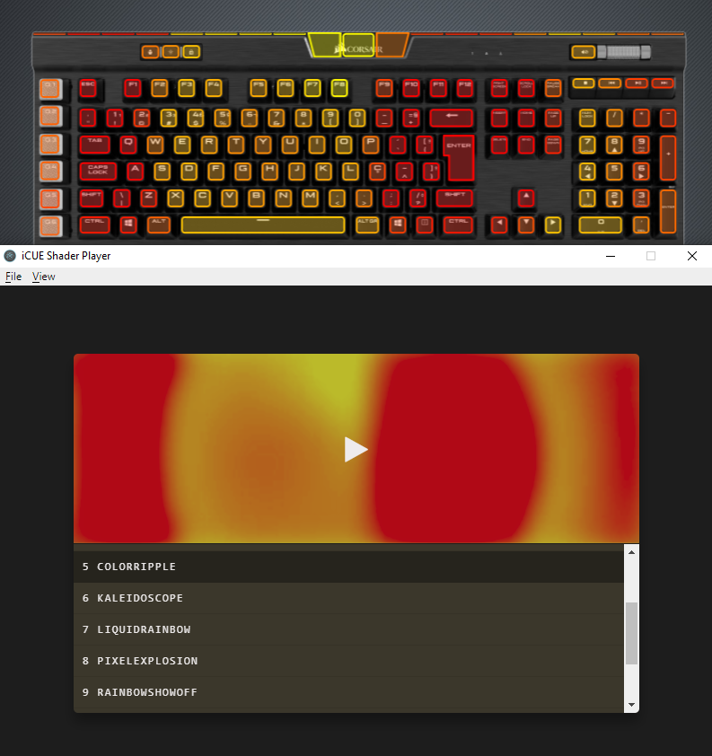
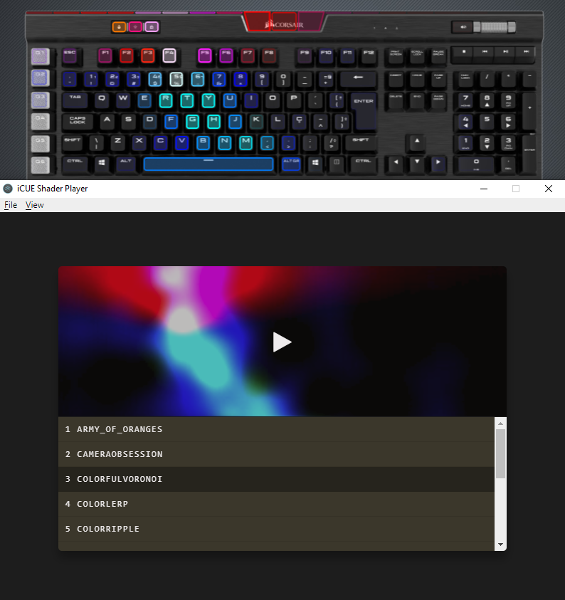

# iCUE Shader Player
Electron application to play GLSL shaders on Corsair keyboard

## Requirements
- iCUE for Windows https://www.corsair.com/icue
- Corsair keyboard (tested on Corsair K95 RGB, should work with any keyboard in the list of supported devices https://corsairofficial.github.io/cue-sdk/#supported-devices)

## Usage

1. Download 7z asset from the latest release https://github.com/intrueder/icue-shader-player/releases
2. Unpack
3. Run `iCUE Shader Player.exe`
4. Click on effects to play them

## Customization
Any effect can be modified or new effects can be added to the player. Effects can be found in `resources\shaders\` subfolder

## Screenshots

